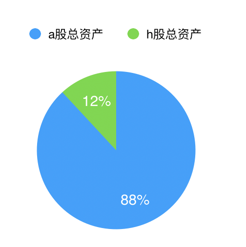
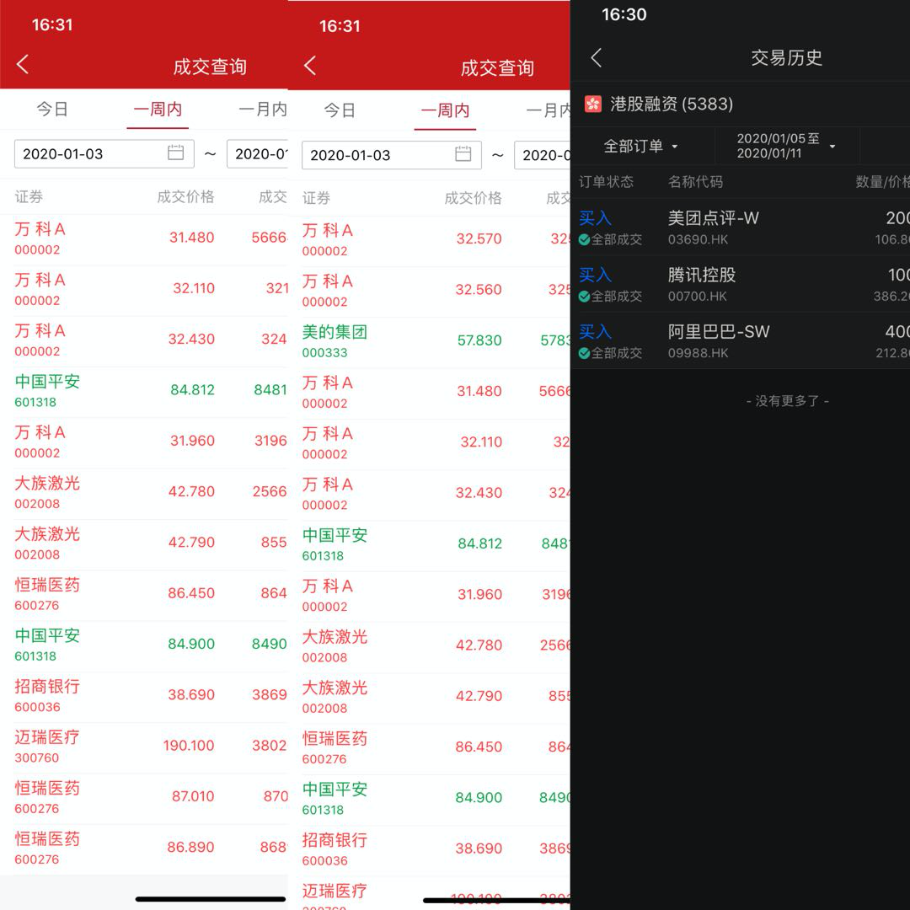

## 投资周报2020/01/11

> 从本篇周报开始，后续每周坚持写下去，持续记录自己的投资，生活和学习等等，投资记录是为了未来检验自己的投资分析和决策，并以此调整让资产更加稳定地增长。

#### 帐户情况

目前一共有3个帐户，其中2个a股账户，1个h股账户。

[自由1号]，a股账户，主账户，有融资。

[自由2号]，h股账户，主账户，有融资。

[自由3号]，a股账户，次账户，没有融资，主投基金。

自由3号的资金很少，可以忽略不考虑，目前自由1号和自由2号占比为 88%和12%

#### 本周交易情况

加仓万科A，加仓大族激光，小比例加仓迈瑞医药和恒瑞医药，加仓招商银行。

减仓中国平安，减仓美的集团。

加仓美团点评，加仓阿里巴巴，加仓腾讯控股。

#### 收益

自由1号，2020年内roe为**7.21%**

自由2号，2020年内roe为**9.09%**

自由3号资金量太少，不加入结算。

自由基金2020年内roe为**7.56%**，沪深300年内收益**1.63%**，恒生指数为**1.59%**

#### 当前持仓

- 美的集团，按2019年扣非净利润230亿算，每股收益是3.29左右，目前股价59.99，静态pe是18，往后3年，今年预估增速范围10～15%，每股收益在3.63～3.79，按18pe为65.36～68.22，**到年底有10%～13%涨幅**。
- 海康威视，按照公司三季度预告，估算今年扣非净利润为126亿，eps则为1.35，给予25pe则为34块，30pe则为40块，如果2020年增速保持15%（很有可能超过15%），则2020的eps为1.55，那么给予25pe则为39块，如果增速超预期，则给予30pe，则达到46块，目前股价34.36，**到年末预估有14%～35%的涨幅**。
- 招商银行，2019年预测920亿，2020年1050亿（按14%增速），估值10～11pe，42-46块，对应市值10500亿-12600亿，为合理偏低范围，目前股价39.04，**到年末预估有10%～18%涨幅**。（银行单纯按pe计算不是很合理，目前暂且这么考虑）
- 伊利股份，2019年预测70亿扣非净利润，eps为1.15，25-30pe则为25-30，目前为32.42块，在合理范围内，预估2020年75.6亿（8%增速），eps为1.24，25-30pe则31-38之间，**到年末预估有-3%～18%的涨幅**。
- 海天味业，2019预测53亿，2020年预测63.6亿（按20%增速），估值45～50pe为合理范围，对应2020年的股价为106～118，**到年末预估有-2%～9%的涨幅**。
- 中国平安，2019预测1450亿，2020年预测1740亿（按20%增速），估值10pe，为95块，目前股价84.78，**到年末预估有12%的涨幅**。（平安单纯按pe计算不是很合理，目前暂且这么考虑）
- 春秋航空，2019预测17.74亿，2020预测20.39亿，2021预测23.45亿，估值20pe，预测2020股价在44.47～51.15之间，**到年末预估有0%～16%的涨幅**。
- 万科a，2019预测411亿，2020预测493亿，估值9-10pe，预测2020股价在39～44之间，目前股价31.46，**到年末预估有24%～40%的涨幅**。
- 大族激光，2019预测6.88亿，2020预测15.3亿，2021预测20亿，给予30pe，预测2020股价在42.9～56之间，**到年末预估有33%的涨幅，如果反转预期不成立，则有亏损的可能**。
- 迈瑞医疗，2019～2021预估46.5/58.11/76.64亿，给予40-50pe，预估2020股价在190～238，**到年底预估有0～25%的涨幅**。
- 恒瑞医疗，2019～2021预测53/66/83亿，给予60pe，股价在89～113之间，目前股价87.5，**年底预估有2%～30%涨幅**。
- 腾讯控股，2019～2021预测950/1185/1482亿，给予35pe，434～543，目前股价398.6，**年底预测有9%～36%的涨幅**。
- 阿里巴巴，2019～2021预测1325/1788/2414亿，2020 eps8.32，给予30pe，252～280，目前股价218，**年底预测有16%～28%的涨幅**。
- 美团点评，预估2022估值10000～12000亿。（后续出分析文章）

#### 本周重要信息

##### 忽略。

#### 下周重要事件

- 中美签署第一阶段合约，从目前外资疯狂买入的态势，估计签署问题不大。
- 春节假期临近，资金面上肯定会有所影响。

#### 免责声明

本文为个人投资记录，文中任何股票的操作或者看法都为作者本人个人的偏见，文中提及的任何个股都有涨跌的风险，不能作为投资决策。

